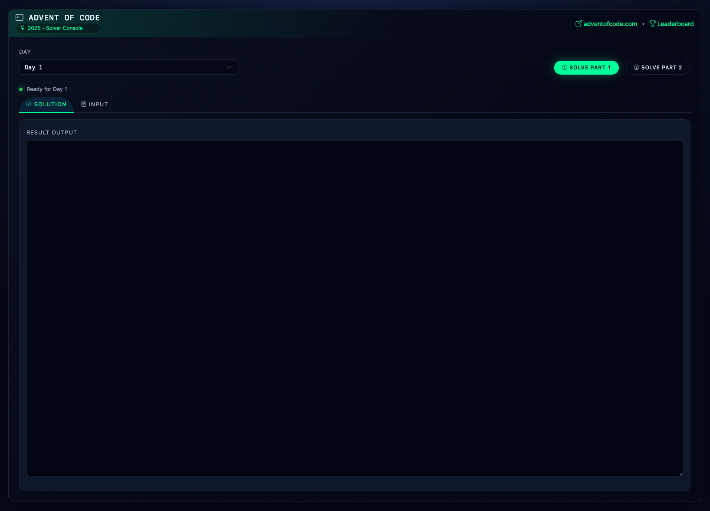

# aoc-2025
Console for solving problems in Advent of Code 2025

[https://adventofcode.com/2025/about](https://adventofcode.com/2025/about)

This is not the most optimal way to solve Advent of Code problems. But for Spring Boot lovers,
it is the funnest way!

Just implement the solution class of the day. Everything else is taken care of with input view, input storage, etc.

To use this project, pull or fork the repo and set the base location in the application.yml file to a place where your input data files are located.

If run with default config. The app is available from: http://localhost:8080/aoc

Have fun!
